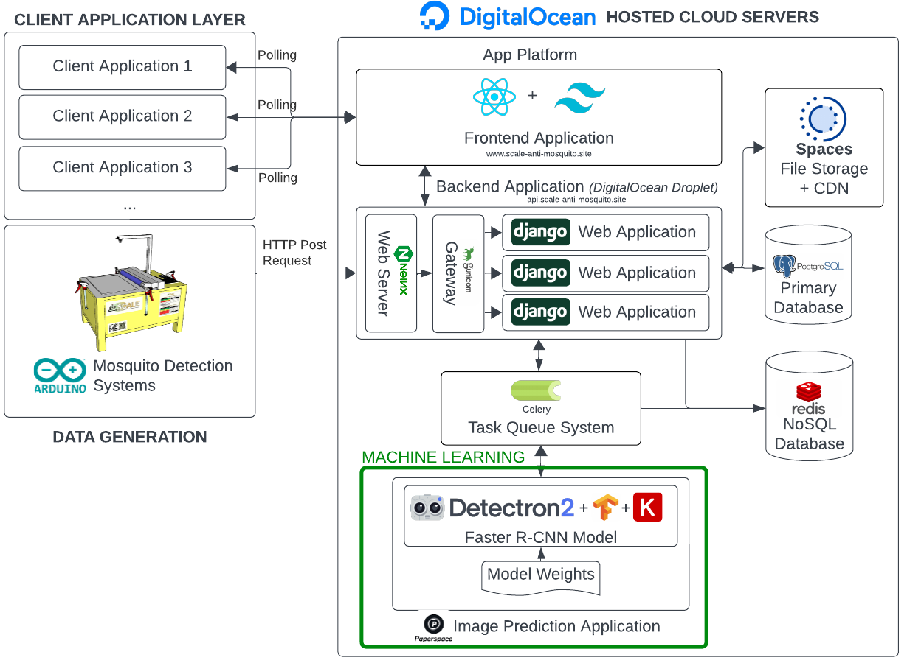
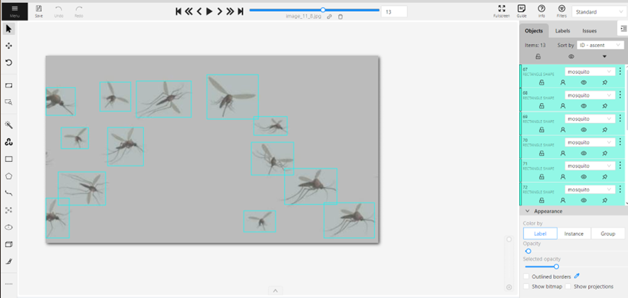
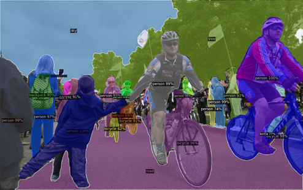
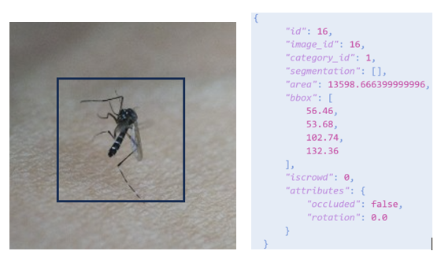
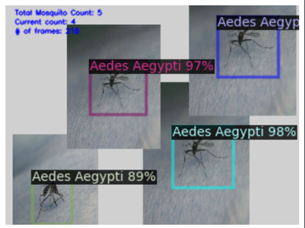

# SCALE - Mosquito Detection and Fumigation (Deep Learning)

This repo is part of a project for our thesis project entitled "**SCALE: Mosquito Detection and Fumigation System Utilizing Convolutional Neural Networks**". The project aims to develop a deep learning model for detecting and localizing mosquitoes in images. The model will be used to support fumigation efforts by identifying areas with high mosquito populations. This repository  involves data collection, annotation, model training, and evaluation to create an accurate and efficient mosquito detection system.

Checkout our [website](https://www.scale-anti-mosquito.site)! 

Other repositories:
- [Website's Backend Repository](https://github.com/PeteCastle/SCALE-Backend)
- [Website's Frontend Repository](https://github.com/PeteCastle/SCALE-Frontend)
- [Prototype's Arduino Code](https://github.com/PeteCastle/SCALE-Arduino)
<!--  -->

### Setting Up
1. *Create your own environment.  Suggested Python version: 3.9*
2. `pip install -r requirements.txt`
3. `pip3 install torch==1.10.1+cu113 torchvision==0.11.2+cu113 torchaudio===0.10.1+cu113 -f https://download.pytorch.org/whl/cu113/torch_stable.html` (Requires CUDA-Enabled Device)
4. Run the Jupyter notebook file `src/train.ipynb`
5. Outputs of the model will be saved in the `output` folder

### Summary

The software architecture for the machine learning model comprises distinct phases: training and testing. During the training phase, the system ingests training photos along with an annotation file formatted using CVAT in COCO format. This input undergoes several stages of image processing, including resizing, normalization, data augmentation, and region proposal. Subsequently, feature extraction takes place, followed by the core of the architecture—the Faster Region-based Convolutional Neural Network (Faster R-CNN) leveraging Detectron 2. This CNN is built on a ResNet-50 backbone and includes a region proposal network, region of interest pooling, and fully connected layers. 

Upon completion of the training phase, the system transitions to the testing phase. Here, it encounters testing photos that undergo similar preprocessing steps as seen in the training phase—resizing, normalization, data augmentation, and region proposal. The prediction stage involves Region of Interest (ROI) pooling, classification, and bounding-box regression. Utilizing existing model weights as input, non-maximum suppression is applied to refine the predictions, resulting in bounding boxes, class labels, and confidence scores as output. These outputs are then compared against ground truth annotations, leading to the computation of evaluation metrics to assess the model's performance. This comprehensive architecture seamlessly integrates image processing, feature extraction, and deep learning techniques to train and evaluate a sophisticated object detection model, catering to both training and testing phases of machine learning workflows.

### About the Model
#### Data Collection Phase
In the annotation phase of the model development process, the focus lies on creating a comprehensive dataset that serves as the foundation for training the model.  The following are the key components and procedures undertaken during the annotation phase:
1.	Data Collection 
  The group has obtained 20 raw images of crowded mosquitoes publicly available via Google Images, as well as 1044 singular photos and datasets of three mosquito species - *Aedes aegypti L., Aedes albopictus L.*, and *Culex quinquefasciatus* provided by Ong & Ahmad (2022) and Pise, Patil, Laad, & Pise (2022).
2.	Data Augmentation
  All 20 raw images of crowded mosquitos were used to expand the size and diversity of a dataset by applying a variety of transformations to the existing data samples, including resizing, horizontal and vertical flips, random crops, gaussian blur, color multiplication, contrast normalization, and additive gaussian noise.  There are now 300 augmented dataset form 20 raw images, plus the 1044 singular photos from existing datasets.
3.	Data Annotation

For data annotation, we utilized the CVAT (Computer Vision Annotation Tool) platform, an open-source tool available at cvat.ai. CVAT provides a user-friendly interface for annotating images and videos with various types of labels, including bounding boxes, polygons, and key points.
The annotation process involves manual annotation by all members of the group, ensuring collective involvement and distributed workload. Each member is responsible for annotating a portion of the dataset, with the images evenly distributed among the group members to maintain consistency and efficiency.
4. Train Test Split
The group has split the data into the standard 70% training and 30% data splitting.  For crowded mosquito dataset, 210 is allotted for training while 90 is allotted for test.  For singular photos, 744 is allotted for training and 300 for testing

#### Training Phase
This study utilizes Detectron 2, a sophisticated platform incorporating the Base Faster Region-Based Convolutional Neural Network alongside the Feature Pyramid Network.
Detectron 2 stands as an advanced open-source object detection system developed by Facebook AI Research. This repository enables users to deploy and train cutting-edge models for diverse detection tasks, including bounding-box detection, instance and semantic segmentation, as well as person keypoint detection.  It has several capabilities such as Mask-RCNN, Cascade R-CNN, rotated bounding boxes, and many more.

##### Backbone Network
The backbone network's primary role is to take an input image and extract feature maps from it. At this stage, there aren't any specific details related to bounding boxes, anchors, or loss functions; it's mainly about generating these maps.  The input to this network is an image represented as a tensor with dimensions (Batch size, 3 channels for BGR color, Image Height, Image Width).
The output from the backbone network is a dictionary of tensors. These tensors represent the extracted feature maps at different scales. Each tensor has dimensions (Batch size, Channel size, Image Height / Stride, Image Width / Stride). The channel size typically defaults to 256, and the strides (S) are set to different values (4, 8, 16, 32, 64) for outputs named P2, P3, P4, P5, and P6, respectively. Different outputs (P2 to P6) capture information from various parts of the input image at different levels of detail. P6, for example, covers a larger area of the input image per pixel compared to P2, meaning it has a broader view or a larger "receptive field." This ability to extract multi-scale feature maps with varying receptive fields is crucial for tasks like object detection.

##### Feature Pyramid Network
The feature pyramid network contains the following pipeline:
1)	**ResNet**
ResNet is a type of neural network architecture. Each ResNet is made up of blocks known as stem and stages. The stem block decreases the image size and produces a feature map. For instance, in ResNet50, the stem block reduces the image size to a quarter of its original dimensions.
2)	**Bottleneck Block**
This block consists of three convolution layers with different kernel sizes. It reduces computational load by using smaller input and output channel numbers for the middle convolution layer. There are three types of bottleneck blocks based on stride and shortcut connections.
3)	**Shortcut Connections**
ResNet uses shortcuts to add input and output features. Convolution layers are used to match channel numbers at the beginning of each stage. Additionally, some blocks downsample the feature map using convolution layers with stride=2 to match input and output channels.
4)	**FPN (Feature Pyramid Network)**
FPN comprises ResNet, lateral convolution layers, output convolution layers, up-samplers, and a last-level maxpool layer. Lateral convolution layers extract features from different stages of ResNet and produce 256-channel feature maps. Output convolution layers perform 3x3 convolutions without changing channel numbers.
5)	**Forward Process in FPN**
Starting from the output of one stage (res5), the FPN uses lateral convolutions to create 256-channel feature maps, which are labeled P5 at a 1/32 scale. These maps are also upsampled and combined with the output of the previous stage (res4), creating feature maps labeled P4 at a 1/16 scale. This process is repeated for several stages, producing P2 (1/4 scale), P3 (1/8), P4 (1/16), and P5 (1/32) feature maps.
6)	**LastLevelMaxPool**
To generate the P6 output, a max pooling layer downsamples the P5 features (1/32 scale) to 1/64-scale features, which are added to the result list.

##### Ground Truth
In the process of training a detection model, ground truth data, which includes annotations about the location and class of objects in an image, are utilized in specific parts of the network. In the case of Base-RCNN-FPN (Faster R-CNN), this data is used within the Region Proposal Network (RPN) and the Box Head, as illustrated in Figure 2.

Annotations for object detection typically consist of two main components:
1.	**Box label** - Describing the location and size of an object within an image, often represented as [x, y, width, height].  In the figure above, the “bbox” key is the respective coordinates of the bounding boxes, x_1, y_1, x_2, and y_2 instead of width and height.
2.	**Category label** - Indicating the class ID of the object.  Category id 1 represents the Aedis Aegypti category.

The process of loading of grounding truth data is the following:
1.	A function must load the dataset from a JSON file and return a list of dictionary records containing image details and annotations.  In this study, COCO data structure is used.  
2.	The dataset mapper processes individual records from the registered annotations to add image data and ground truth annotations ('Instances') to the dataset dictionary.
3.	Image is read, transformed, and registered as image tensors of shape.
4.	The annotations are converted to 'Instances', which include information such as bounding box coordinates and category IDs represented as tensors.

##### Region Proposal Network
The Region Proposal Network (RPN) serves as a key component within the RCNN detector, facilitating the connection between feature maps and ground-truth box locations and sizes. This network consists of a neural network, referred to as the RPN Head, and additional functionalities to generate proposals for potential objects within images.
The RPN Head comprises three convolution layers: convolutions, anchor deltas, and feature maps from five levels.
1.	Anchors are generated by associating abjectness maps and anchor deltas maps with ground truth boxes, and anchor boxes (or 'cell anchors').
2.	Ground Truth Preparation is done by calculating Intersection-over-Union (IoU) matrices between ground truth boxes and anchors.  Algorithm is used to label anchors as foreground, background, or ignored based on IoU thresholds.
3.	Loss functions are applied to predicted and ground truth maps those outputs two metrics: localization loss and objectness loss.
4.	Finally, the network selects 1000 'region proposal' boxes by applying predicted anchor deltas to corresponding anchors, then sorting predicted boxes by objectness scores at each feature level, then by choosing top-scored boxes from each level and performing non-maximum suppression.  Non-maximum suppression reduces overlapping region proposal boxes into one instance.

The resulting proposal boxes, along with their associated scores, are obtained as 'Instances' and are utilized in subsequent stages of the object detection process.

##### Region of Intersection Head
The final stage in the object detection pipeline is the ROI (Box) Head, which takes feature maps from the FPN, proposal boxes, and ground truth boxes as input. 
1.	The output feature maps from the Feature Pyramid Network (FPN) are used in the ROI Head. These feature map sizes correspond to different FPN levels.
2.	Proposal boxes are included in the RPN output instances and consist of 1000 'proposal_boxes' and 1000 'objectness_logits'. Only proposal boxes are used in ROI Heads for cropping the feature maps.  Then, they are fed into the ROI Heads to crop regions of interest (ROIs) from the feature maps.
3.	ROI Pooling is done by cropping rectangle regions from the feature maps specified by the proposal boxes.  It is then assigned to appropriate feature map levels based on box sizes and canonical box sizes.
4.	Lastly, the box head network processes the cropped features.  It consists of fully connected layers and the final prediction layers (cls_score and bbox_pred).

The output tensors contain class scores and bounding box predictions for each ROI across the batch.

### Model Testing
The performance of the trained model is evaluated using Detectron2's built-in testing tool. The testing tool provides various metrics to assess the model's effectiveness in detecting and localizing objects in the test dataset. The following metrics are typically reported:

1.	**Average Precision (AP):**
*	Average precision over different intersection over union (IoU) thresholds ranging from 0.50 to 0.95, considering all object areas and up to 100 detections per image.
*	Average precision at IoU threshold of 0.50, considering all object areas and up to 100 detections per image.
*	Average precision at IoU threshold of 0.75, considering all object areas and up to 100 detections per image.
*	Average precision over different IoU thresholds for small objects.
*	Average precision over different IoU thresholds for medium-sized objects.
*	Average precision over different IoU thresholds for large objects.
2.	**Average Recall (AR):**
*	Average recall over different IoU thresholds ranging from 0.50 to 0.95, considering all object areas and one detection per image.
*	Average recall over different IoU thresholds considering all object areas and up to ten detections per image.
*	Average recall over different IoU thresholds considering all object areas and up to 100 detections per image.
*	AR @[IoU=0.50:0.95 | area=small | maxDets=100]: Average recall over different IoU thresholds for small objects.
*	Average recall over different IoU thresholds for medium-sized objects.
*	Average recall over different IoU thresholds for large objects.
Additionally, the model is retrained in different COCO Object baselines under Faster R-CNN, with varying results:
*	R50-FPN (1x learning rate)
*	R50-FPN (3x learning rate)
*	R101-FPN 
*	X101-FPN

The best model for the dataset is selected based on (1) Average precision over different IoU thresholds for large objects (2) Average precision over different intersection over union (IoU) thresholds ranging from 0.50 to 0.95.

